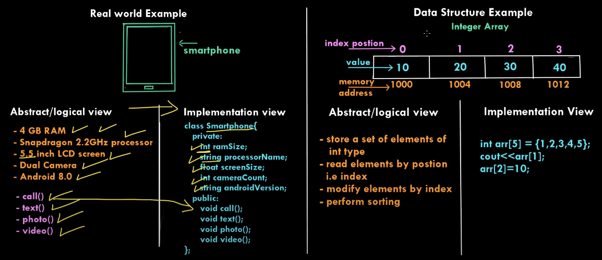
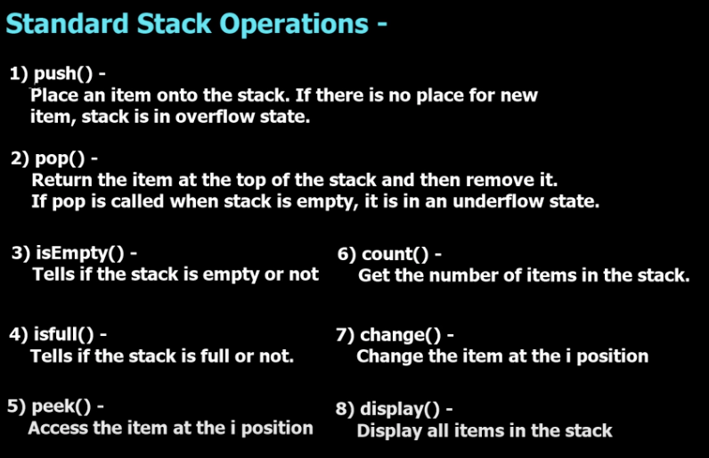

# Data Structures and Algorithms in _C++_

> Credit to : [Simple Snippets](https://www.youtube.com/channel/UCRIWTSgd7hGtZhx4RYoASEg) Youtube channel. 


## Abstract Data Type
- ADTs are entities that are definitions of data and operations but do not have implementation details. i.e. ADTs can be a mathematical model or logic but do not have a fixed implementation.  
- The implementation might differ based on what programming language is being used to define it.  
- e.g., a particular data structure in C can be defined using the concept of _structures_ but the same data structure in C++ or JAVA can be defined by _OOPs_ . 




## Stack Data Structure

- Stack is a linear data structure which operates in a **LIFO(Last IN First Out)** or **FILO(First In Last Out)** pattern. 
- It is named as stack as it behaves like real world stack of objects.
- Very simple and linear data structure that allows adding or removing elements in a particular order (LIFO or FILO)
- In stack, items/elements are added and removed from the top of the stack. (PUSH and POP operation respectively).




#### Application of stack data structure.
1. balacing of symbols while writing a program in any IDE.
2. undo-redo features.
3. browing forward and backward pages. 
4. used in algorithms like Tower of hanoi or tree traversals etc. 

#### Example Code:

[Stacks Code](DSAbySimpleSnippets/DSA_stacks.cpp)


## Queue Data Structure

- Queue is a linear data structure which operates in **FIFO(First In First Out)** or **LILO (Last In Last Out) pattern**.
- It exactly behaves as the real world queue in which whoever enters first will be out first. 
- Similar to **Stack**, **Queue** is also a very simple abstract data type with a bounded capacity.
- Queues can be used in CPU Scheduling, Disk Scheduling, handling of errors in real time.
- In real life, call center phone systems will use queues to hold call in order. 

#### Working of a Queue
- Elements are always added at _rear end_, which is called **Enqueue**.
- And, elements are removed from _front/head end_, which is called **Dequeue**.


#### Standard Queue Operations

1. ```enqueue()```: Element is added from the _rear/back end_. 
2. ```dequeue()```: Element is removed from _fron/head end_.
3. ```isEmpty()```: Check is queue is empty.
4. ```isFull()```: Check if queue is full.
5. ```count()```: count of total items on the queue. 

#### Example Code

[Queue Code](DSAbySimpleSnippets/DSA_queue.cpp)