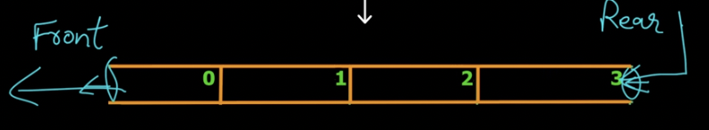

# Data Structures and Algorithms in _C++_

> Credit to : [Simple Snippets](https://www.youtube.com/channel/UCRIWTSgd7hGtZhx4RYoASEg) Youtube channel. 


## Abstract Data Type
- ADTs are entities that are definitions of data and operations but do not have implementation details. i.e. ADTs can be a mathematical model or logic but do not have a fixed implementation.  
- The implementation might differ based on what programming language is being used to define it.  
- e.g., a particular data structure in C can be defined using the concept of _structures_ but the same data structure in C++ or JAVA can be defined by _OOPs_ . 


## Stack Data Structure

- Stack is a linear data structure which operates in a **LIFO(Last IN First Out)** or **FILO(First In Last Out)** pattern. 
- It is named as stack as it behaves like real world stack of objects.
- Very simple and linear data structure that allows adding or removing elements in a particular order (LIFO or FILO)
- In stack, items/elements are added and removed from the top of the stack. (PUSH and POP operation respectively).


#### Application of stack data structure.
1. balacing of symbols while writing a program in any IDE.
2. undo-redo features.
3. browing forward and backward pages. 
4. used in algorithms like Tower of hanoi or tree traversals etc. 

#### Example Code:

[Stacks Code](DSAbySimpleSnippets/DSA_stacks.cpp)


## Queue Data Structure

- Queue is a linear data structure which operates in **FIFO(First In First Out)** or **LILO (Last In Last Out) pattern**.
- It exactly behaves as the real world queue in which whoever enters first will be out first. 
- Similar to **Stack**, **Queue** is also a very simple abstract data type with a bounded capacity.
- Queues can be used in CPU Scheduling, Disk Scheduling, handling of errors in real time.
- In real life, call center phone systems will use queues to hold call in order. 

#### Working of a Queue
- Elements are always added at _rear end_, which is called **Enqueue**.
- And, elements are removed from _front/head end_, which is called **Dequeue**.



#### Standard Queue Operations

1. ```enqueue()```: Element is added from the _rear/back end_. 
2. ```dequeue()```: Element is removed from _fron/head end_.
3. ```isEmpty()```: Check is queue is empty.
4. ```isFull()```: Check if queue is full.
5. ```count()```: count of total items on the queue. 

#### Example Code

[Queue Code](DSAbySimpleSnippets/DSA_queue.cpp)

## Circular Queue Data Structure
- This is very similar to Queue data structure with minor changes to address the major disadvantages of Queue data structure. 
- So, in Queue, when ```dequeue``` operation is performed, the element that is dequeued replaced by 0 in the array. In that case even after removing the element, that vacant memory block of array (occupied by 0) becomes useless untill all the elements of the queue is dequeued.
- To overcome this disadvantage, **Circular Queue Data Structure** is used. Once the element is dequeued from the head and queue is full otherwise, then the next enqueued number is stored in place of dequeued numeber but at the same time head _rear/back_ is shifted one place forward so that the enqueued element becomes last(like a queue in circle).


#### Standard Queue Operations

1. ```enqueue()```: Element is added from the _rear/back end_. 
2. ```dequeue()```: Element is removed from _fron/head end_.
3. ```isEmpty()```: Check is queue is empty.
4. ```isFull()```: Check if queue is full.
5. ```count()```: count of total items on the queue. 

#### Example Code

[Circular Queue Code](DSAbySimpleSnippets/DSA_circular_queue.cpp)

## Linked List Data Structure.

#### What is Linked List ?
- **Linked List** is a linear data structure in which the elements are not stored in a contiguous memory locations. The elements in a linked list are linked using pointers. 
- Simply, a linked list consist of nodes, where each node containes an element and reference(link) to the next node in the list. 


#### Working of Linked List.

- In linked list, as the elements are not stored in a contiguous(fixed) memory location, each node in the linked list consist of two parts
    1. Data (element/data field)
    2. link/reference to the next node. 


#### Linked List vs Array

**Advantages**:  
    1. Linked List has a dynamic size. 
    2. e.g, when the size of te array is predefined and array is not full, then memory got assigned to the array but not fully utilized; which is not the case with linked list as the memory is assigned dynamically based on requirement.  
    3. The insertion/deletion of elements in linked list is easier compared to array  
    4. e.g., suppose there is an array which is storing elements in ascending order (say ```arr[1, 3, 5]```). Now, to insert next element 2 to the array while maintaining ascending order, we need to make space to for 2 at position 2, and have to shift 3 and 5 to make room for 2. But in linked list, we can simply change the reference to make room for one more element as shown in following snippet. 


**disadvantages**  
    1. In linked list, random access is not allowed, as the elements have to addressed sequentially starting from the first node.  
    2. Extra memory is required to store reference of the next node along with data of the first node.  
    3. Linked lists are not cache friendly, as elements are not stored in contiguous memory locations. 

#### Linked List Operations


1. Traversing a linked list
2. Append a new node(to the end) of a list.
3. Prepend a new node(to start) of list.
4. Inserting a new node to a specific position in the list. 
5. Deleting a node from the list. 
6. Updating a node in the linked list.


#### Types of Linked List

1. Singly Linked List.
2. Doubly Linked List.
3. Circular Linked List. 


#### Applications of Linked List

- Can be used to implement _Stacks_ and _Queues_. 
- Can also be used to implement _Graphs_. 

## Singly Linked List

[explanation video](https://www.youtube.com/watch?v=NgdwfP7K5n8&list=PLIY8eNdw5tW_zX3OCzX7NJ8bL1p6pWfgG&index=11&ab_channel=SimpleSnippets)  
[code video](https://www.youtube.com/watch?v=mDt53JLj8sM&list=PLIY8eNdw5tW_zX3OCzX7NJ8bL1p6pWfgG&index=12&ab_channel=SimpleSnippets)

#### Logic Flow

1. create a class named ```Node``` for creating node
  - each node will have 3 elements ```n(key, data, *next)```
  - ```key```: unique key for the node; ```data```: data to be stored in the list; ```*next``` a pointer storing address of next node of list
  - define a default contructor with ```key = 0; data = 0; next = NULL```
  - define paarmeteric constructor with parameters ```(key and data)```.

2. Create a class named ```SinglyLinkedList``` for creating a Linked List. 
  - create a pointer of class ```Node``` named head, which will store the address of first element of linked list.
  - define a default contructor which will assign ```head = NULL```.
  - define a parametric constructor which will accept the ```&node``` and assign it to pointer ```head```.

3. Define a function ```nodeExist``` with argument ```key``` of the node, which will return ```Node*```. 
  - This function will take in ```key``` as an argument and will check whether the node will this key alreay exist or not. And if exist then return the pointer of that node.

4. Define a function ```appendNode(Node* n)```, which will append Node at the end of Linked List.
  - check whether node with key 'k' exist or not.
    - if node exist --> exit
    - else
      - if no node in the list (i.e., head == NULL), then append new npde 'n' to head.
      - else, traverse through the list till find end (ptr->next == NULL), and append new node after last node.

5. Define a function ```prependNode(Node* n)```, which will prepend node -> attach node at the start.
  - check whether node with key 'k' exist or not
    - if node exist --> exit
    - else assign address of node 'n' in with head and change head pointer to address of node 'n'.

6. Define a function ```insertNode(int k, Node* n)```, which will insert a node after a particular node in the list.
  - get the pointer of concerned node using ```nodeExist``` function.
  - if node exist --> exit
  - else
    - if node to be inserted already exist --> exit
    - else
      - assign 'next' of new node with 'next' of node with key 'k'
      - Now, change 'next' of node with key 'k' to address of new node.
    
7. Define a function ```deleteNode(int k)```, which will delete node by key.
  - get the pointer of concerned node using ```nodeExist``` function.
  - if node exist --> exit
  - else
    - instantiate a node and assign it a head value so that we can traverse the list from head
    - if node at k is head node
      - change head with head pointer.
    - else delete any node other than head
      - traverse through the list till find the pointer of concerned node
      - change the 'next' of previous node with 'nect' of concerned pointer.

8. Define a function ```updateNodeByKey(int k, int d)```, Update node by key.
  - get the pointer of concerned node using ```nodeExist``` function.
  - if node exist --> exit
  - else change the data of concerned pointer with updated data

[Singly Linked List Code](DSAbySimpleSnippets/DSA_singly_linked_list.cpp)
